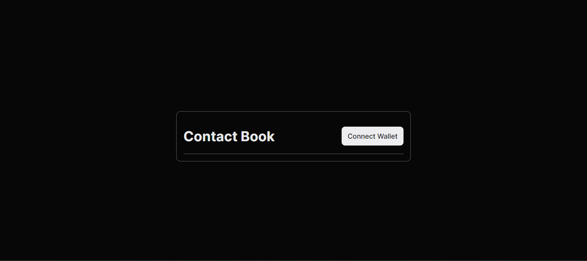

# Ethereum Contact Book App



## Overview

The Ethereum Contact Book App is a decentralized application (DApp) built with Next.js that allows users to manage their contacts on the Ethereum blockchain. It leverages the ThirdWeb platform to interact with Ethereum smart contracts. This README provides information on how to set up and use the application.

## Features

- Create, read, update, and delete contact information on the Ethereum blockchain.
- Connect to your Ethereum wallet using MetaMask or other Web3 wallets.
- View a list of your contacts, including their name, address, and other details.
- Easily access and manage your Ethereum-based contact book.

## Prerequisites

Before getting started, make sure you have the following installed:

- Node.js and npm: https://nodejs.org/
- MetaMask or another Web3 wallet extension for your browser: https://metamask.io/
- A ThirdWeb account: https://thirdweb.io/

## Installation

1. Clone this repository:

   ```shell
   git clone https://github.com/yourusername/ethereum-contact-book-app.git
   cd ethereum-contact-book-app
   ```

## Deployment

To deploy the Ethereum Contact Book App to a production environment, follow the Next.js deployment instructions. You may choose to host it on platforms like Vercel, Netlify, or your own server.

## Contributing

Feel free to contribute to this project by creating issues or submitting pull requests. Contributions are welcome!

## License

This project is licensed under the MIT License - see the LICENSE file for details.

## Acknowledgments

This project was built using Next.js, ThirdWeb, and Ethereum smart contracts.
Special thanks to the open-source community for their contributions and support.
Contact

<b>If you have any questions or need assistance, please feel free to reach out to us at contact@example.com.</b>
